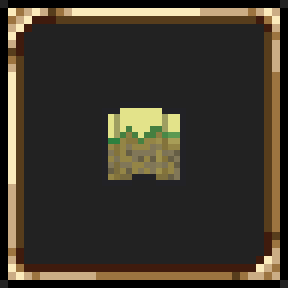
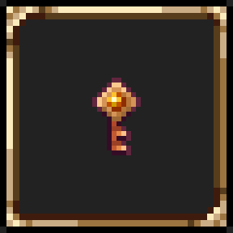
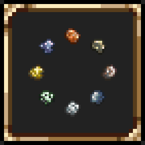
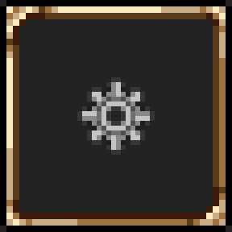
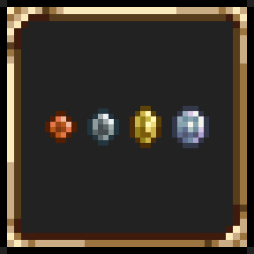

# Terraria Mods

This is a monorepo containing all of my Terraria mods for the [TerrariaModder](https://inidar1.github.io/terraria-modder/) framework.

All mods are built for Terraria 1.4.5 and require TerrariaModder 0.4.0.

## Mods

|                                                                       |                                                                                                                               |
| --------------------------------------------------------------------- | ----------------------------------------------------------------------------------------------------------------------------- |
|  | [**Fullbright**](src/FullBright/) <br><br> Force all tiles to render at full brightness.                                      |
|                       | [**Minimap Mode**](src/MinimapMode/) <br><br> Automatically set the minimap to the configured mode when loading into a world. |
|              | [**Rare Drop Notification**](src/RareDropNotification/) <br><br> Show a chat message when a rare item is dropped.             |
|                        | [**Select Ores**](src/SelectOres/) <br><br> Select which ores are generated in your world, independent of world seed.         |
|                   | [**Settings Keybind**](src/SettingsKeybind/) <br><br> Add a configurable keybind to toggle the settings menu.                 |
|                      | [**Value Tooltip**](src/ValueTooltip/) <br><br> Display the sell value of items in their tooltip even outside of shops.       |

## Installation

Install [TerrariaModder](https://inidar1.github.io/terraria-modder/installation/).

### With TerrariaModder Vault

You can find all of the mods in the "Browse Nexus" section.

### Manually

1. Download the [latest release](https://github.com/neverify/terraria-mods/releases/latest) of any mod or from [Nexus Mods](https://www.nexusmods.com/terraria).
2. Extract the downloaded `.zip` files into `Terraria/TerrariaModder/mods/`.

## Development

Mods are located in `src/` where each mod is a separate C# project.

The `src/Utils/` folder contains shared utilities – currently only a helper for harmony patching.

`Directory.Build.props` contains MSBuild properties common to all projects. These include

- Framework and language settings
- Code analysis settings
- Assembly references

`Directory.Build.targets` configures the build output directories and the optional automatic deployment on build.
`Directory.Build.local.props` contains the assembly reference paths.

Each mod has its own `README.md` file documenting the mod's logic.

### Setup

1. Install required tools:
   - [.NET 10](https://dotnet.microsoft.com/en-us/download) (lower versions also work)
   - [.NET Framework 4.8 SDK](https://dotnet.microsoft.com/en-us/download/dotnet-framework/net48)
2. Clone the repository.
3. Copy and rename `Directory.Build.local.props.example` to `Directory.Build.local.props`.
4. Add paths for the assembly references in `Directory.Build.local.props`:
   - `TerrariaModderCoreProject` or `TerrariaModderCoreDll`
   - `TerrariaExe`
   - `HarmonyDll`
   - `XnaFrameworkGameDll` (has default install location)
   - `XnaFrameworkDll` (has default install location)
5. To enable automatic deployment, set the following values:
   - `DeployToGame=true`
   - `DeployPath` pointing to `Terraria/TerrariaModder/mods/`
6. Build a mod with `dotnet build`:

   ```bash
   dotnet build src/FullBright/FullBright.csproj -c Release
   ```

   Build output is written to `build/<mod-id>/`. The mod's `manifest.json` and `icon.png` are automatically copied as well.

   If automatic deployment is enabled, the build is also copied over to `Terraria/TerrariaModder/mods/`.

The script `build-all.ps1` builds all projects at once. This is mostly useful when all mods need to be rebuilt due to a common change.

## Suggestions and contributing

If you have any suggestions or mod requests, feel free to open an issue or contact me in the [TerrariaModder Discord](https://discord.gg/VvVD5EeYsK) (@neverify).

If you want to contribute, please contact me on Discord first :)

## Credits

A massive thanks to Inidar1 for creating the TerrariaModder framework. It makes all of these mods possible and the wait for tModLoader 1.4.5 bearable :D

Mod icons use Terraria assets.
