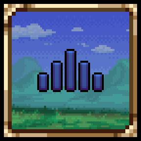
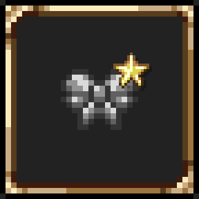
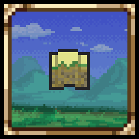
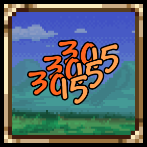
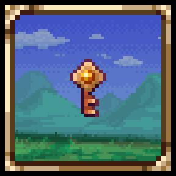
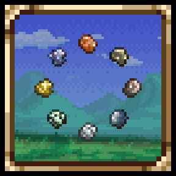
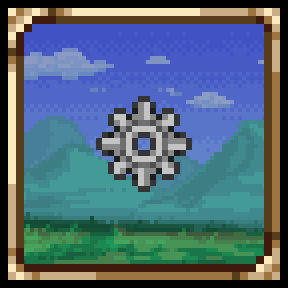
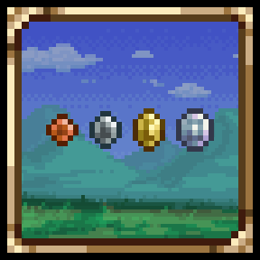

# Terraria Mods

This is a monorepo containing all of my Terraria mods for the [TerrariaModder](https://inidar1.github.io/terraria-modder/) framework.

All mods are built for **Terraria 1.4.5.8** and require **TerrariaModder 0.4.1**.

None of the mods have explicit multiplayer support, but might still work at least partially.

## Mods

|                                                                  |                                                                                                                                                                     |
| ---------------------------------------------------------------- | ------------------------------------------------------------------------------------------------------------------------------------------------------------------- |
|      | [**Better Traveling Merchant**](src/BetterTravelingMerchant/) <br><br> Increase the spawn rate of the Traveling Merchant and force certain items to always be sold. |
|          | [**Deterministic Drops**](src/DeterministicDrops/) <br><br> Reduce variance in item drops while preserving vanilla drop rates.                                      |
|                   | [**Fullbright**](src/FullBright/) <br><br> Force all tiles to render at a configured brightness.                                                                    |
|  | [**Functional Social Accessories**](src/FunctionalSocialAccessories/) <br><br> Make accessories in social slots functional.                                         |
|        | [**Hide Social Accessories**](src/HideSocialAccessories/) <br><br> Hide accessories in social slots on the player.                                                  |
|                  | [**Minimap Mode**](src/MinimapMode/) <br><br> Automatically set the minimap to the configured mode when loading into a world.                                       |
|             | [**No Damage Variance**](src/NoDamageVariance/) <br><br> Disable the ±15% damage variance for all sources of damage.                                                |
|         | [**Rare Drop Notification**](src/RareDropNotification/) <br><br> Show a configurable chat message when a rare item is dropped.                                      |
|                   | [**Select Ores**](src/SelectOres/) <br><br> Select which ores are generated in your world during worldgen and when smashing altars.                                 |
|              | [**Settings Keybind**](src/SettingsKeybind/) <br><br> Add a configurable keybind to toggle the settings menu.                                                       |
|                  | [**Undeprecate**](src/Undeprecate/) <br><br> Prevent Terraria from removing deprecated items.                                                                       |
|                 | [**Value Tooltip**](src/ValueTooltip/) <br><br> Display the sell value of items in their tooltip even outside of shops.                                             |

## Installation

Install [TerrariaModder](https://inidar1.github.io/terraria-modder/installation/).

### With TerrariaModder Vault

You can find all of the mods in the "Browse Nexus" tab.

### Manually

1. Download the latest release of any mod from [GitHub](https://github.com/neverify/terraria-mods/releases) or from [Nexus Mods](https://www.nexusmods.com/terraria).
2. Extract the downloaded .zip file and move the folder inside into `Terraria/TerrariaModder/mods/`.

## Development

Mods are located in `src/` where each mod is a separate C# project.

The `src/Utils/` folder contains shared utilities.

`Directory.Build.props` contains MSBuild properties common to all projects. These include

- Framework and language settings
- Code analysis settings
- Assembly references

`Directory.Build.targets` configures the build output directories and the optional automatic deployment on build.
`Directory.Build.local.props` contains the assembly reference paths.

Each mod has its own `README.md` file documenting the mod's logic.

### Setup

1. Install required tools:
   - [.NET 10](https://dotnet.microsoft.com/en-us/download)
   - [.NET Framework 4.8 SDK](https://dotnet.microsoft.com/en-us/download/dotnet-framework/net48)
2. Clone the repository.
3. Copy and rename `Directory.Build.local.props.example` to `Directory.Build.local.props`.
4. Add paths for the assembly references in `Directory.Build.local.props`:
   - `TerrariaModderCoreProject` or `TerrariaModderCoreDll`
   - `TerrariaExe`
   - `HarmonyDll`
   - `XnaFrameworkGameDll` (has default install location)
   - `XnaFrameworkDll` (has default install location)
5. To enable automatic deployment, set the following values:
   - `DeployToGame=true`
   - `DeployPath` pointing to `Terraria/TerrariaModder/mods/`

   Mods that are not already present in the deploy destination are not deployed by default. To override this, provide the `-p:DeployAbsent=true` argument in the build command.

6. Build a mod with `dotnet build`:

   ```pwsh
   dotnet build src/<ModName> -c Release
   ```

   Build output is written to `build/<mod-id>/`. The mod's `manifest.json` and `icon.png` are automatically copied as well.

   If automatic deployment is enabled, the build is also copied over to `Terraria/TerrariaModder/mods/`.

The script `build-all.ps1` builds all projects at once. This is mostly useful when all mods need to be rebuilt due to a common change. To deploy absent mods, provide the flag `-DeployAbsent`.

The script `release.py` builds and releases mods whose manifest version is newer than their latest Git tag. It displays the release status of each mod, validates the changelog, creates a Git tag, and creates a draft GitHub release with the built zip attached. Dependencies are defined using PEP 723 metadata; it is recommended to run the script via `uv run` or an equivalent tool. Alternatively the environment has to have all the dependencies installed. The script uses GitHub CLI to upload the release, so it has to be installed and authenticated to. Run `--help` for more information.

Published GitHub releases are uploaded to Nexus Mods by `.github/workflows/upload-to-nexus.yml`. The workflow constructs the details of the release with the `scripts/prepare-nexus-upload.py` Python script, downloads the release zip with GitHub CLI and uses the Nexus Mods GitHub action to perform the update.

## Questions, Suggestions, Bug Reports and Contributing

If you have any questions, suggestions or have found a bug, feel free to open an issue or contact me in the [TerrariaModder Discord](https://discord.gg/VvVD5EeYsK) (@neverify). You can also report bugs in the `Bugs` tab of the Nexus Mods page of the respective mod.

If you want to contribute, please contact me on Discord first :​)

## Credits

A massive thanks to [Inidar1](https://github.com/Inidar1) for creating the TerrariaModder framework and [ConfuzzedCat](https://github.com/ConfuzzedCat) for creating TerrariaInjector. They make all of these mods possible and the wait for tModLoader 1.4.5 bearable <​3

Mod icons use Terraria assets.
